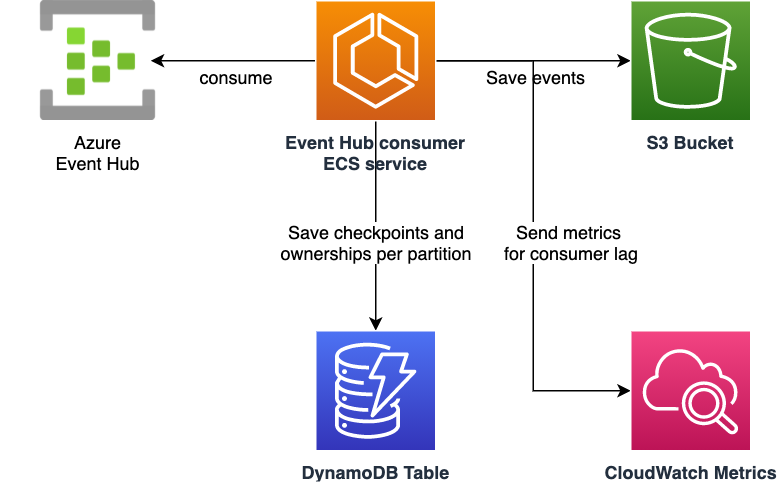
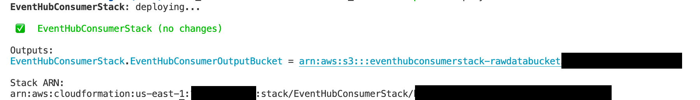

# Azure Event Hub Consumer with DynamoDB
This is a sample implementation of Azure Event Hub consumer on ECS, storing checkpoint and ownership information in a DynamoDB table, and saving all the event data to a S3 bucket.
Additionaly it reports metrics for consumer latency to CloudWatch Metrics. You can further use this metrics for autoscaling ECS service, monitoring how well consumers are working, and more.

Below is the architecture diagram for this sample.



## Deploy
Before deploying this sample, you must install AWS Cloud Development Kit prerequisites. [Please refer to this document](https://docs.aws.amazon.com/cdk/latest/guide/getting_started.html) for the detailed instruction. Please make sure you've successfully completed `cdk bootstrap` step.

After that, clone this repository and go to `infrastructure` directory.

```sh
cd infrastructure
```

You must first install Node.js dependencies for CDK code by the following commands:

```sh
npm ci
```

Now you can deploy this sample stack (`EventHubConsumerStack`) by the following command:

```sh
CONNECTION_STRING=<your_eventhub_connection_string> npx cdk deploy --require-approval never
```

You must pass your Event Hub's connection string by `CONNECTION_STRING` environment variable. Please refer to [Get an Event Hubs connection string](https://docs.microsoft.com/en-us/azure/event-hubs/event-hubs-get-connection-string) to obtain it.
Please note that your connection string must include the name of your Event Hub topic.

Initial deployment usually takes about 5 minutes.

After a successful deployment, you can check the ARN of the S3 bucket, in which all the events data will be saved.



## Usage
When you send events to an Event Hub topic you specifid in the connection string, the events will be saved to the S3 bucket.

You can see saved event data in [S3 management console](https://console.aws.amazon.com/s3).
You can also check the consumer's execution logs in [ECS management console](https://console.aws.amazon.com/ecs), or metrics for consumer's latency in [CloudWatch Metrics management console](https://console.aws.amazon.com/cloudwatch).

## Clean up
To avoid incurring future charges, clean up the resources you created.

You can remove all the AWS resources deployed by this sample running the following command:

```sh
cd infrastructure
npx cdk destroy --force
```

## Security
See [CONTRIBUTING](CONTRIBUTING.md#security-issue-notifications) for more information.

## License
This library is licensed under the MIT-0 License. See the LICENSE file.
